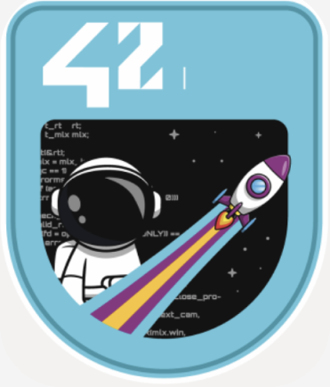

### Hello! 👋

---

- 🌱 My name is <b>David Florido</b> and I’m currently studying Software Engineering at <a href="https://www.42network.org" >42Network </a> in Barcelona 

##  Progress:

#### Phase 1
  
  
  
  
  *Creating an own C library recoding basic functions and knowing Virtual Machines*

  
#### Phase 2
  
  *This project is a very small 2D game:*

#### Technolodies and tools

<!-- Resources -->
<!-- Gifs: https://giphy.com/
<!-- Shields: https://shields.io/ -->
<!-- GitHub Profile README: https://github.com/devhector/devhector -->
<!-- Awesome GitHub Profile README: https://github.com/abhisheknaiidu/awesome-github-profile-readme -->

<!--
**DavidFlorido32/DavidFlorido32** is a ✨ _special_ ✨ repository because its `README.md` (this file) appears on your GitHub profile.

Here are some ideas to get you started:

- 🔭 I’m currently working on ...
- 🌱 I’m currently learning ...
- 👯 I’m looking to collaborate on ...
- 🤔 I’m looking for help with ...
- 💬 Ask me about ...
- 📫 How to reach me: ...
- 😄 Pronouns: ...
- ⚡ Fun fact: ...
-->
